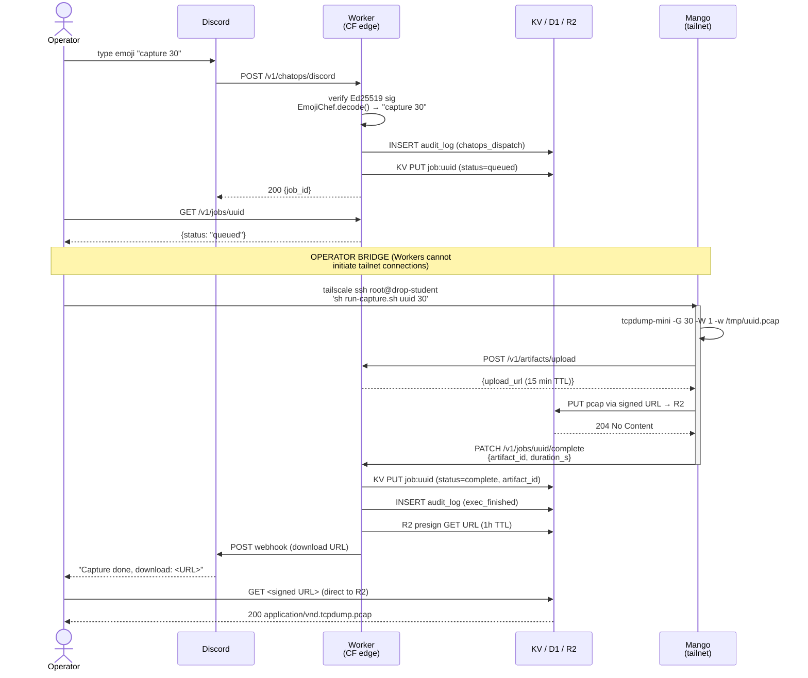

# Lab 14 Capstone — Dispatch Flow

Sequence diagram for the full round-trip from Discord emoji to signed pcap URL.
Use this during the instructor narration of the capstone demo.

---

## ASCII sequence diagram

```
Operator          Discord         Worker (CF edge)     KV / D1 / R2      Mango (tailnet)
   |                 |                  |                    |                  |
   |  type emoji     |                  |                    |                  |
   |---------------->|                  |                    |                  |
   |                 |  POST webhook    |                    |                  |
   |                 |----------------->|                    |                  |
   |                 |                  |  verify Ed25519    |                  |
   |                 |                  |  sig               |                  |
   |                 |                  |  EmojiChef.decode()|                  |
   |                 |                  |  --> "capture 30"  |                  |
   |                 |                  |                    |                  |
   |                 |                  |  INSERT audit_log  |                  |
   |                 |                  |------------------->| (chatops_dispatch|
   |                 |                  |                    |  row)            |
   |                 |                  |  KV PUT job:<id>   |                  |
   |                 |                  |  status=queued     |                  |
   |                 |                  |------------------->|                  |
   |                 |                  |                    |                  |
   |                 |  200 {job_id}    |                    |                  |
   |                 |<-----------------|                    |                  |
   |                 |                  |                    |                  |
   |  GET /v1/jobs/<id>                 |                    |                  |
   |------------------------------------>                    |                  |
   |  {status:queued}                   |                    |                  |
   |<------------------------------------                    |                  |
   |                                                         |                  |
   |  ** OPERATOR BRIDGE STEP **                             |                  |
   |  tailscale ssh root@drop-<student> 'sh run-capture.sh' |                  |
   |-------------------------------------------------------->|                  |
   |                 |                  |                    |  tcpdump-mini    |
   |                 |                  |                    |  -G 30 -W 1      |
   |                 |                  |                    |  -w /tmp/<id>    |
   |                 |                  |                    |  .pcap           |
   |                 |                  |                    |  (30s capture)   |
   |                 |                  |                    |                  |
   |                 |  POST /v1/artifacts/upload            |                  |
   |                 |                  |<-----------------------------------------
   |                 |                  |  mint signed PUT   |                  |
   |                 |                  |  URL (15 min TTL)  |                  |
   |                 |                  |  {upload_url}      |                  |
   |                 |                  |----------------------------------------->
   |                 |                  |                    |                  |
   |                 |                  |                    |  PUT <signed-url>|
   |                 |                  |                    |  pcap to R2      |
   |                 |                  |                    |<-----------------
   |                 |                  |                    |  204 No Content  |
   |                 |                  |                    |----------------->|
   |                 |                  |                    |                  |
   |                 |  PATCH /v1/jobs/<id>/complete         |                  |
   |                 |  {artifact_id, duration_s}            |                  |
   |                 |                  |<-----------------------------------------
   |                 |                  |  KV PUT job:<id>   |                  |
   |                 |                  |  status=complete   |                  |
   |                 |                  |------------------->|                  |
   |                 |                  |  R2 presign GET    |                  |
   |                 |                  |  URL (1h TTL)      |                  |
   |                 |                  |  INSERT audit_log  |                  |
   |                 |                  |  exec_finished     |                  |
   |                 |                  |------------------->|                  |
   |                 |                  |  POST Discord      |                  |
   |                 |                  |  webhook           |                  |
   |                 |<-----------------|                    |                  |
   |  "Capture done, |                  |                    |                  |
   |   download: URL"|                  |                    |                  |
   |                 |                  |                    |                  |
   |  GET <signed-url> (direct to R2, no Worker)            |                  |
   |------------------------------------------------------> R2                 |
   |  200 application/vnd.tcpdump.pcap                      |                  |
   |<------------------------------------------------------  |                  |
```

---

## Mermaid version (renders in GitHub / VS Code Markdown Preview)



---

## Key architectural points to call out during narration

1. **Worker is stateless.** It processes each HTTP request independently. No persistent
   connections, no background threads, no access to the tailnet. Every request to the
   Worker is a fresh execution context.

2. **The operator is the bridge.** The split between "Worker enqueues job" and "Mango
   executes job" is deliberate. In a real engagement, the operator would have an
   automated polling daemon in the devcontainer watching for queued jobs and dispatching
   them. The workshop makes this explicit by requiring the manual `tailscale ssh` step.

3. **Tailscale for command dispatch; Worker (public internet) for data exfil.** The Mango
   receives its command over the tailnet (private, encrypted, access-controlled). It
   uploads the pcap to R2 via the public Worker URL (because the Mango cannot initiate
   outbound tailnet connections to the Worker — it uses CF Access service token auth
   instead). These are two separate security planes that the architecture keeps distinct.

4. **Signed URLs scope the artifact access.** The operator gets a time-limited signed URL,
   not a persistent public URL. After 1 hour, the URL is dead. The R2 object remains in
   the bucket. This mirrors real exfil scenarios where you want the collection window to
   close automatically.

5. **D1 audit_log is tamper-evident.** Every action — decode, dispatch, exec, upload,
   deliver — is written to D1 with a timestamp and the acting entity. An instructor can
   reconstruct the full engagement timeline from audit_log alone.
